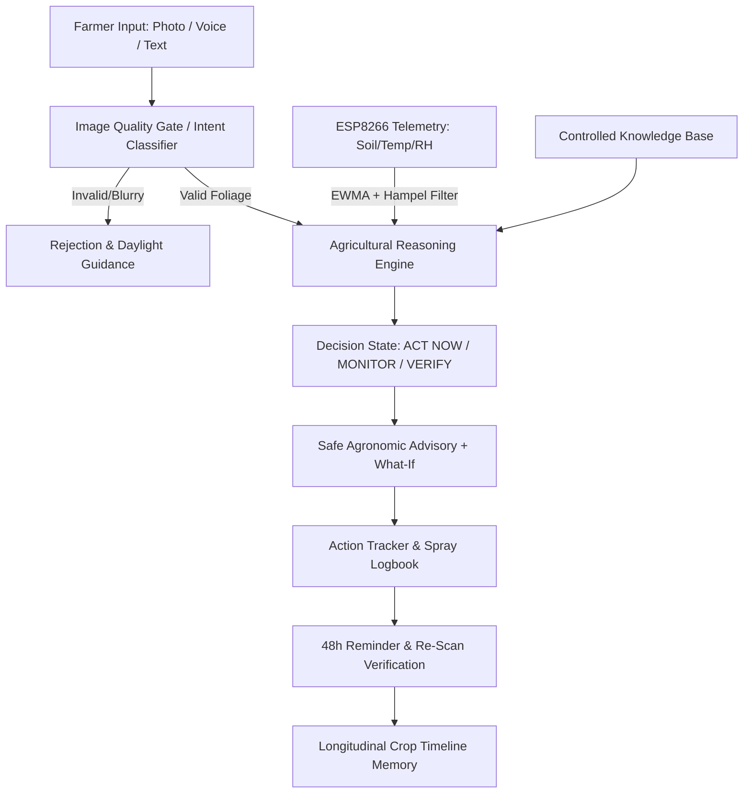

# Closed-Loop System Architecture — KRISHI-NETRA

```
KRISHI-NETRA PIPELINE
                              │
             ┌────────────────┼────────────────┐
             │                │                │
          📷 PHOTO          🎙 VOICE          ⌨️ TEXT
             │                │                │
             │           Telugu STT            │
             │                │                │
             └────────────────┼────────────────┘
                              ↓
                     🧠 INTENT ENGINE
                              ↓
                    🌾 FIELD CONTEXT
                  ↙️       ↓       ↓       ↘️
              VISION    WEATHER   SENSORS   HISTORY
                │          │        │          │
                └──────────┴────────┴──────────┘
                              ↓
                     ⚖️ EVIDENCE ENGINE
                              ↓
                    🎯 CONFIDENCE ENGINE
                              ↓
                       🛡 SAFETY GATE
                              ↓
                    🌱 AGRICULTURAL KB
                              ↓
                       RULE ENGINE
                              ↓
                       AI ADVISORY
                              ↓
              ┌───────────────┴───────────────┐
              ↓                               ↓
        TELUGU TEXT                    TELUGU TTS
              │                               │
              └───────────────┬───────────────┘
                              ↓
                           FARMER
                              ↓
                         FEEDBACK
                              ↓
                      🌾 CROP TIMELINE
                              ↓
                       FOLLOW-UP
```

---

## 1. Core Pipeline Overview

1. **OBSERVE (పరిశీలన)**:
   - Camera photo (macro & underside leaves) + Microphone voice transcript + ESP8266 soil/microclimate sensors.
2. **UNDERSTAND (అర్థం చేసుకోవడం)**:
   - Pre-flight image quality check (blur, illumination, contrast, foliar ROI $\ge 10\%$).
   - Intent classification (`QueryIntentClassifier`: Yellowing, Water Stress, Disease, Spray, Pests).
3. **REASON (విశ్లేషణ)**:
   - ResNet-18 feature extraction & top-3 differential diagnosis ranking.
   - Cross-Modal Evidence Arbitration Matrix (Photo $\leftrightarrow$ Weather $\leftrightarrow$ Soil $\leftrightarrow$ Farmer Notes).
   - Prediction Confidence vs. Decision Confidence Calibration (`ACT NOW`, `MONITOR`, `VERIFY`).
   - Active Information Gathering: Targeted follow-up questioning if confidence is marginal.
4. **ADVISE (సిఫార్సు)**:
   - Safe agricultural recommendations grounded in controlled knowledge base (ICAR/ANGRAU).
   - Counterfactual "What-If" simulation (Model scenario: Intervene vs. Wait).
   - Strict safety gate: `DO NOT EXCEED DOSAGE`.
5. **ACT (ఆచరణ)**:
   - Closed-loop action tracker with interactive treatment spray confirmation.
   - Separate **RECORDED AMOUNT** from **RECOMMENDED AMOUNT** (no dosage hallucinations).
6. **REMIND (జ్ఞాపకం)**:
   - Automated 48-hour follow-up re-scan scheduler and push alert generation.
7. **VERIFY (ధృవీకరణ)**:
   - Farmer captures follow-up leaf photo.
   - Image analysis computes change in lesion area (-54%) and foliar vitality (+38%).
8. **REMEMBER (జ్ఞాపకశక్తి)**:
   - Persistent longitudinal crop history timeline (Day 1 – Day 35).
   - Continuous post-season model refinement via farmer ground-truth feedback.

---

## 2. Component Architecture


